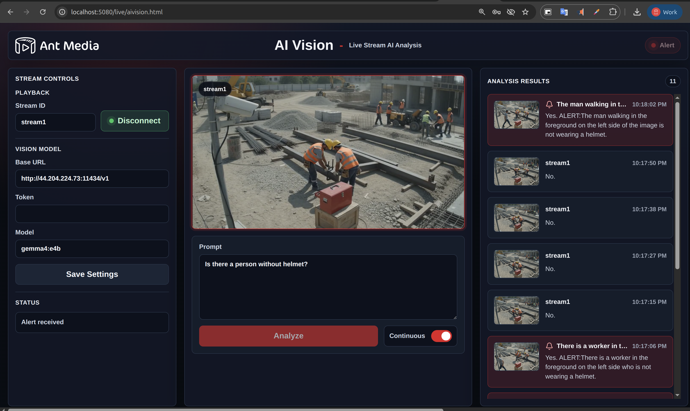
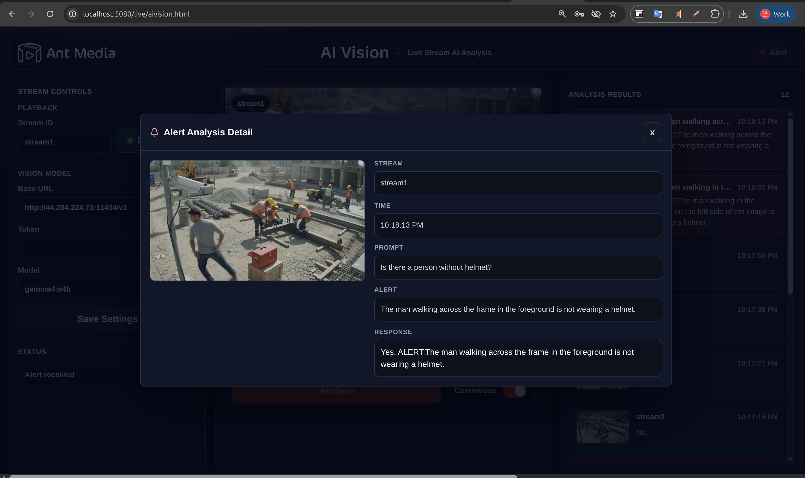

# AI Vision Plugin

AI Vision Plugin adds prompt-based analysis to live Ant Media Server streams.

With this plugin, you can watch an ongoing broadcast and ask questions about what is happening in the stream. AI Vision decodes live video frames, sends the selected frame to an OpenAI-compatible vision model, and shows the model response together with the analyzed frame.

You can use it to describe the current scene, detect specific situations, trigger alerts, or build custom monitoring flows on top of live video. The UI supports one-shot analysis with `Analyze` and repeated analysis with the `Continuous` switch.



You can also download the product-style brochure: [AI Vision Brochure](doc/aivision-brochure.pdf).

For example, you can ask prompts like:

```text
Describe what is visible in this stream.
```

```text
Alert me if there is smoke, fire, or an unsafe situation.
```

```text
Tell me if a person enters the restricted area.
```

The plugin works with OpenAI-compatible vision APIs, so you can use a hosted AI provider or run a local/on-prem model with Ollama.

## Features

- Analyze live stream frames with a custom text prompt.
- Run one-time analysis or continuous analysis.
- Keep an analysis history with the AI response and a thumbnail of the analyzed frame.
- Open any analysis result to inspect the full response, prompt, timestamp, and frame.
- Trigger alerts for yes/no prompts when the model returns an `ALERT:{explanation}` line.
- Use hosted OpenAI-compatible APIs or a local/on-prem Ollama model.



## Installation

Install AI Vision with one command:

```bash
wget -qO- https://raw.githubusercontent.com/ant-media/Plugins/master/AIVision/install.sh | sudo sh
```

## Prepare AI Access

AI Vision needs an OpenAI-compatible vision API. You can use a hosted provider such as OpenAI, or run your own local/on-prem model with Ollama.

### OpenAI

Use OpenAI if you want a hosted model. Create or manage your API key from the [OpenAI API keys page](https://platform.openai.com/api-keys).

```text
Base URL: https://api.openai.com/v1
Token: your OpenAI API key
Model: gpt-4o-mini
```

### Local Model

Use Ollama if you want to run the model locally or on-prem. See [Ollama Setup for AI Vision](doc/OLLAMA.md) for Linux and Docker installation steps.

```text
Base URL: http://<ollama-host>:11434/v1
Token: leave empty
Model: llava
```

## Usage

After installation, open the AI Vision page from your Ant Media application:

```text
http://your-ant-media-server:5080/live/aivision.html
```

Then:

1. Enter the stream ID.
2. Click `Connect`.
3. Enter the base URL, token, and model from [Prepare AI Access](#prepare-ai-access).
4. Click `Save AI Settings`.
5. Write a prompt for the live stream.
6. Click `Analyze`, or enable `Continuous` to keep analyzing new frames.

Analysis results appear in the right panel with the AI response and a thumbnail of the analyzed frame. Click any result to open the full detail popup.

## Alerts

For yes/no style prompts, AI Vision automatically adds an instruction to the model request:

```text
If this prompt is a yes/no question and the answer is yes, include exactly one line in this format: ALERT:{explanation}.
```

If the model response contains `ALERT:`, the result is marked as an alert in the UI with a bell icon and alert styling. If the model answers no and does not include `ALERT:`, no alert is created.

---

## Development

The end-user installer uses a prebuilt zip package. For development, the package is produced by Maven and contains:

```text
aivision.jar
aivision.html
```

Build it locally with:

```bash
mvn clean package -Dmaven.javadoc.skip=true -Dmaven.test.skip=true -Dgpg.skip=true
```

The generated package is:

```text
target/aivision.zip
```
